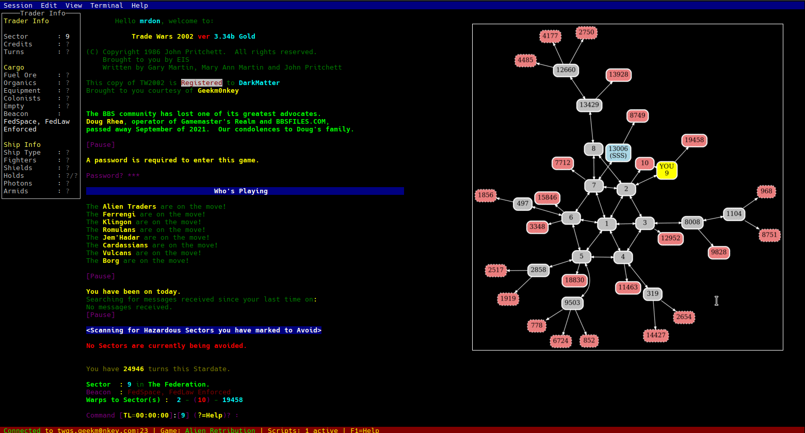

# Twist - Trade Wars 2002 TUI

A modern text UI (TUI) client helper for Trade Wars 2002, featuring real-time game info, TWX-compatible 
scripting, and an interactive terminal interface.



## Features

- **Real-time Game Parsing**: Automatically parses Trade Wars 2002 game data including sectors, traders, ships, and ports
- **Interactive Terminal UI**: Clean terminal interface with sector maps, trader info, and game statistics
- **Scripting Engine**: Supports custom TWX-based scripts for game automation
- **Database Integration**: Stores game data with SQLite for persistence
- **Sector Mapping**: Visual sector map with warp connections and hazard indicators
- **Multi-game Support**: Works with various Trade Wars 2002 servers and game types

## Quick Start

### Prerequisites

- Go 1.19 or later
- Make (for build automation)

### Building

```bash
make build
```

### Running Tests

```bash
make test
```

### Usage

```bash
./twist [options]
```

The proxy will connect to Trade Wars 2002 servers and provide an enhanced interface with:

- Real-time sector information display
- Automated data collection and parsing
- Script execution capabilities
- Visual sector mapping
- Game statistics tracking

## Development

### Testing

The project includes comprehensive tests:

- Unit tests for core components
- Integration tests for game parsing
- Streaming tests for real-time data processing

```bash
# Run all tests
make test

# Run integration tests
go test -tags=integration ./integration/...
```

## Based on TWX Proxy

This project is based on the [TWX Proxy](http://wiki.classictw.com/index.php/Application:TWX_Proxy), specifically the recent fork at https://github.com/TW2002/twxp. TWX Proxy is a well-established tool in the Trade Wars 2002 community that provides scripting and automation capabilities for the game.

## Contributing

1. Fork the repository
2. Create a feature branch
3. Add tests for new functionality
4. Ensure all tests pass with `make test`
5. Submit a pull request

## License

Licensed under the Apache License, Version 2.0. See the [LICENSE](LICENSE) file for details.