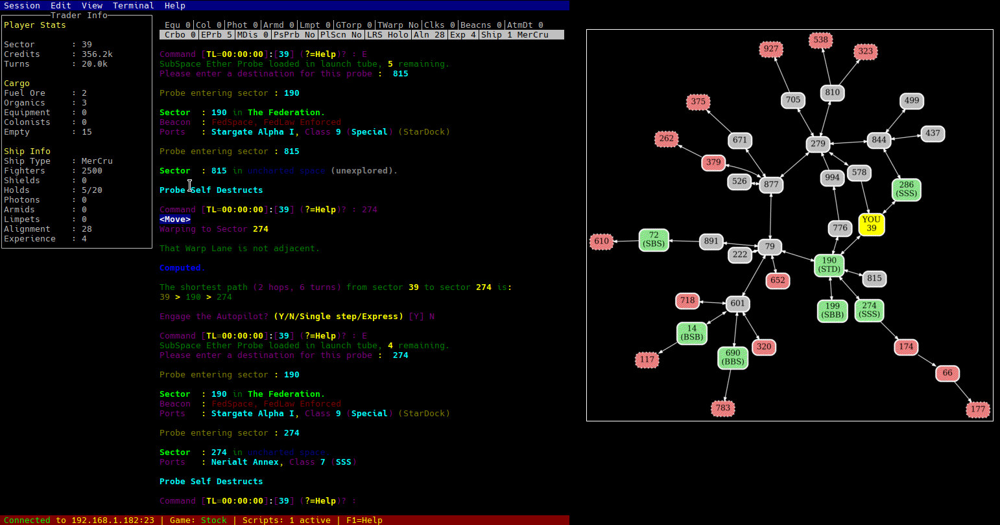

# Twist - Trade Wars 2002 TUI

A modern text UI (TUI) client helper for Trade Wars 2002, featuring real-time game info, TWX-compatible 
scripting, and an interactive terminal interface.



## Status

**⚠️ Early Alpha - Not for Production Use**

- **Limited testing**: Only tested on Linux with modern terminals like Konsole
- **TWX compatibility incomplete**: See [@docs/twx-gaps.md](docs/twx-gaps.md) for detailed analysis

## Features

- **Real-time Game Parsing**: Automatically parses Trade Wars 2002 game data including sectors, traders, ships, and ports
- **Interactive Terminal UI**: Clean terminal interface with sector maps, trader info, and game statistics
- **Scripting Engine**: Supports custom TWX-based scripts for game automation
- **Database Integration**: Stores game data with SQLite for persistence
- **Sector Mapping**: Visual sector map with warp connections and hazard indicators
- **Multi-game Support**: Works with various Trade Wars 2002 servers and game types

## Quick Start

### Prerequisites

- Go 1.19 or later
- Make (for build automation)

### Building

```bash
make build
```

### Running Tests

```bash
make test
```

### Usage

```bash
./twist [options]
```

## Development

### Building and Testing

```bash
# Build and run the application
make run

# Run all tests
make test
```

## Based on TWX Proxy

This project is based on the [TWX Proxy](http://wiki.classictw.com/index.php/Application:TWX_Proxy), specifically the recent fork at https://github.com/TW2002/twxp. TWX Proxy is a well-established tool in the Trade Wars 2002 community that provides scripting and automation capabilities for the game.

## FAQ

### Q: The screen jumps up and down when running in tmux - how do I fix this?

This is a compatibility issue between the TUI framework (tview) and tmux's terminal emulation. The problem occurs when the terminal content starts scrolling.

**Solution**: Set tmux to use the xterm terminal database instead of screen:

```bash
# Option 1: Run with environment variable
TERM=xterm-256color tmux

# Option 2: Add to your ~/.tmux.conf (permanent fix)
set -g default-terminal "xterm-256color"
```

After changing `.tmux.conf`, restart tmux for the change to take effect.

**Why this happens**: Tmux's default TERM setting (`screen` or `screen-256color`) interprets certain scrolling escape sequences differently than standard terminals, causing display issues with TUI applications. Using `xterm-256color` provides more standardized terminal behavior.

**Alternative**: If you prefer not to change tmux settings, you can run Twist directly in your terminal outside of tmux.

## Contributing

1. Fork the repository
2. Create a feature branch
3. Add tests for new functionality
4. Ensure all tests pass with `make test`
5. Submit a pull request

## License

Licensed under the Apache License, Version 2.0. See the [LICENSE](LICENSE) file for details.