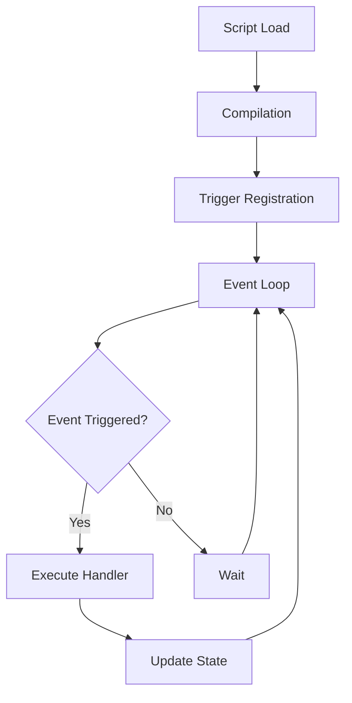

# TWX Scripting Engine Analysis & Porting Guide

## Table of Contents
1. [Overview](#overview)
2. [Compatibility Status](#compatibility-status)
3. [TWX Script Language Features](#twx-script-language-features)
4. [Script Execution Model](#script-execution-model)
5. [Built-in Functions Analysis](#built-in-functions-analysis)
6. [System Constants](#system-constants)
7. [Porting Architecture](#porting-architecture)
8. [Implementation Steps](#implementation-steps)
9. [Code Examples](#code-examples)

## Overview

The TWX Proxy scripting system is a comprehensive automation framework that allows users to write scripts for TradeWars 2002 gameplay. **Source code analysis reveals the actual scope:**

- **159 built-in commands** (not 116 as previously documented)
- **160 system constants** (previously undocumented)
- **Complex bytecode virtual machine** with stack-based execution
- **Advanced trigger system** with pattern matching
- **Event-driven execution** with triggers and callbacks
- **Full variable system** with arrays and type coercion
- **File I/O and networking** capabilities
- **Game-specific functions** for sector navigation and data manipulation
- **Menu and window management** for user interfaces
- **Multi-bot support** and instance management
- **Library command system** with advanced scripting capabilities

## Compatibility Status

### Updated Twist Implementation Status (Latest Analysis - January 2025)
- **🟢 Script Manager**: 100% complete (load, stop, persist, database integration)
- **🟢 Control Flow**: 100% complete (IF/ELSE/WHILE/GOTO/GOSUB fully implemented)
- **🟢 Label System**: 100% complete (findLabel, jump resolution, stack management)
- **🟡 Commands**: 25% complete (basic I/O, control flow, some game commands)
- **🔴 System Constants**: 5% complete (basic constants only, missing 155+ constants)
- **🔴 Triggers**: 20% complete (basic interface, missing comprehensive trigger types)
- **🔴 Arrays**: 0% complete (only simple variables, no multi-dimensional arrays)
- **🟡 Virtual Machine**: 60% complete (direct text execution, missing bytecode compilation)

### Current Implementation Scope (Revised from Current Analysis)
- **Total Features Required**: 319 (159 commands + 160 constants)
- **Current Completion**: ~30% of total TWX functionality (basic foundation solid)
- **Critical Missing**: Arrays, comprehensive triggers, text processing, most system constants
- **Estimated Development Time**: Significant work remains for full TWX compatibility

## TWX Script Language Features

### Syntax Overview
```twx
# Comments start with #
$variable := "string value"
$number := 42
$array[1] := "first element"

# Control structures
if ($condition)
    echo "true branch"
elseif ($other)
    echo "other branch"
else
    echo "false branch"
end

while ($condition)
    echo "looping"
end

# Labels and jumps
:labelName
goto :labelName
gosub :subroutine
return
```

### Variable System
- **Dynamic typing**: Variables can hold strings, numbers, or arrays
- **Global scope**: All variables are global within a script
- **Type coercion**: Automatic conversion between strings and numbers
- **Array support**: Dynamic arrays with numeric indexing
- **Persistent storage**: Variables can be saved/loaded from disk

### Execution Model


## Script Execution Model

### Compilation Process
1. **Lexical Analysis**: Parse source into tokens
2. **Syntax Analysis**: Build Abstract Syntax Tree (AST)
3. **Code Generation**: Compile to bytecode format
4. **Optimization**: Parameter type checking and constant folding

### Runtime Architecture
- **Virtual Machine**: Stack-based execution engine
- **Memory Management**: Garbage collection for variables and objects
- **Trigger System**: Event-based execution with pattern matching
- **State Persistence**: Save/restore script state across sessions

### Trigger Types
```twx
# Text matching triggers
setTextTrigger 1 :handler "text pattern"
setTextLineTrigger 2 :handler "line pattern"
setTextOutTrigger 3 :handler "output pattern"

# Time-based triggers
setDelayTrigger 4 :handler 5000  # 5 second delay

# Event triggers
setEventTrigger 5 :handler "Connection lost"

# Auto triggers (persistent)
setAutoTrigger 6 :handler "pattern" "response"
```

## Built-in Functions Analysis

### Function Categories (159 total commands - verified from TWX source code)

#### 1. Core Programming (15 commands)
- **Variables**: `SETVAR`, `SETARRAY`, `LOADVAR`, `SAVEVAR`
- **Control Flow**: `GOTO`, `GOSUB`, `RETURN`, `BRANCH`, `HALT`, `PAUSE`
- **Conditionals**: `IF/ELSEIF/ELSE/END` (built into parser)
- **Loops**: `WHILE/END` (built into parser)

#### 2. String Operations (23 commands)
- **Manipulation**: `CUTTEXT`, `GETTEXT`, `MERGETEXT`, `REPLACETEXT`
- **Analysis**: `GETLENGTH`, `GETWORD`, `GETWORDCOUNT`, `FIND`, `FINDALL`
- **Transformation**: `UPPERCASE`, `LOWERCASE`, `TRIM`, `STRIPANSI`
- **Formatting**: `PADLEFT`, `PADRIGHT`, `CENTER`, `FORMAT`, `REPEAT`

#### 3. Arithmetic Operations (6 commands)
- **Basic Math**: `ADD`, `SUBTRACT`, `MULTIPLY`, `DIVIDE`, `MODULUS`
- **Utilities**: `ROUND`, `GETRND`, `SETPRECISION`

#### 4. Comparison Operations (7 commands)
- **Comparison**: `ISEQUAL`, `ISNOTEQUAL`, `ISGREATER`, `ISLESSER`
- **Range**: `ISGREATEREQUAL`, `ISLESSEREQUAL`
- **Type**: `ISNUMBER`

#### 5. File Operations (8 commands)
- **File Management**: `DELETE`, `RENAME`, `FILEEXISTS`, `DIREXISTS`
- **Directory**: `MAKEDIR`, `REMOVEDIR`, `GETFILELIST`, `GETDIRLIST`
- **I/O**: `READ`, `WRITE`, `READTOARRAY`

#### 6. Network Operations (6 commands)
- **Connection**: `CONNECT`, `DISCONNECT`
- **Communication**: `SEND`, `WAITFOR`, `PROCESSIN`, `PROCESSOUT`

#### 7. Trigger Management (9 commands)
- **Text Triggers**: `SETTEXTTRIGGER`, `SETTEXTLINETRIGGER`, `SETTEXTOUTTRIGGER`
- **Time/Event**: `SETDELAYTRIGGER`, `SETEVENTTRIGGER`
- **Auto Triggers**: `SETAUTOTRIGGER`, `SETAUTOTEXTTRIGGER`
- **Management**: `KILLTRIGGER`, `KILLALLTRIGGERS`

#### 8. User Interface (14 commands)
- **Output**: `ECHO`, `ECHOEX`, `CLIENTMESSAGE`, `SOUND`
- **Input**: `GETINPUT`, `GETCONSOLEINPUT`, `GETOUTTEXT`
- **Menus**: `OPENMENU`, `CLOSEMENU`, `ADDMENU`, `GETMENUVALUE`, `SETMENUVALUE`
- **Windows**: `WINDOW`, `KILLWINDOW`, `SETWINDOWCONTENTS`

#### 9. Game-Specific Functions (11 commands)
- **Navigation**: `GETCOURSE`, `GETDISTANCE`, `GETALLCOURSES`, `GETNEARESTWARPS`
- **Sectors**: `GETSECTOR`, `GETSECTORPARAMETER`, `SETSECTORPARAMETER`
- **Avoidance**: `SETAVOID`, `CLEARAVOID`, `CLEARALLAVOIDS`, `LISTAVOIDS`

#### 10. Date/Time Operations (6 commands)
- **Current Time**: `GETDATE`, `GETTIME`, `GETDATETIME`
- **Calculations**: `DATETIMEDIFF`, `DATETIMETOSTR`
- **Timers**: `GETTIMER`, `STARTTIMER`, `STOPTIMER`

#### 11. Script Management (6 commands)
- **Lifecycle**: `LOAD`, `STOP`, `STOPALL`, `SYSTEMSCRIPT`
- **Information**: `LISTACTIVESCRIPTS`, `GETSCRIPTVERSION`, `REQVERSION`

#### 12. Database Operations (8 commands)
- **Management**: `OPENDATABASE`, `CLOSEDATABASE`, `CREATEDATABASE`, `DELETEDATABASE`
- **Operations**: `EDITDATABASE`, `COPYDATABASE`, `RESETDATABASE`, `LISTDATABASES`

#### 13. Bot Management (6 commands)
- **Control**: `SWITCHBOT`, `GETBOTLIST`, `OPENINSTANCE`, `CLOSEINSTANCE`
- **Communication**: `GETDEAFCLIENTS`, `SETDEAFCLIENTS`

#### 14. Global Variables (4 commands)
- **Persistence**: `SAVEGLOBAL`, `LOADGLOBAL`, `CLEARGLOBALS`, `LISTGLOBALS`

#### 15. System Commands (7 commands)
- **Internal**: `SYS_CHECK`, `SYS_FAIL`, `SYS_KILL`, `SYS_NOAUTH`, `SYS_NOP`, `SYS_SHOWMSG`
- **Utilities**: `REQRECORDING`, `LOGGING`

### Additional Commands Found in Source Analysis (43+ commands not in original documentation)
- **Advanced String Operations**: `CUTLENGTHS`, `SPLITTEXT`, `CONCAT`, `TRUNCATE`, `GETCHARCODE`
- **Advanced UI**: `SETMENUHELP`, `SETMENUOPTIONS`, `SETMENUKEY`, `ADDQUICKTEXT`, `CLEARQUICKTEXT`
- **System Integration**: `OPENINSTANCE`, `CLOSEINSTANCE`, `LIBCMD`, `SAVEHELP`, `REQRECORDING`
- **Logical Operations**: `AND`, `OR`, `XOR` (separate from boolean expressions)
- **Advanced Variables**: `SETPROGVAR` (program-scoped variables)

## System Constants

### TWX System Constants (160 total - completely missing from current implementation)

#### ANSI Color Constants (16 constants)
```twx
ANSI_0, ANSI_1, ANSI_2, ANSI_3, ANSI_4, ANSI_5, ANSI_6, ANSI_7
ANSI_8, ANSI_9, ANSI_10, ANSI_11, ANSI_12, ANSI_13, ANSI_14, ANSI_15
```

#### Player Status Constants (28 constants)
```twx
TURNS, CREDITS, FIGHTERS, SHIELDS, TOTALHOLDS, OREHOLDS, ORGHOLDS
EQUHOLDS, COLHOLDS, EMPTYHOLDS, PHOTONS, ARMIDS, LIMPETS, GENTORPS
TWARPTYPE, CLOAKS, BEACONS, ATOMICS, CORBOMITE, EPROBES, MINEDISR
PSYCHICPROBE, PLANETSCANNER, SCANTYPE, ALIGNMENT, EXPERIENCE, CORP
SHIPNUMBER, SHIPCLASS
```

#### Sector Information Constants (20 constants)
```twx
SECTOR.WARPS, SECTOR.WARPCOUNT, SECTOR.WARPSEIN, SECTOR.WARPINCOUNT
SECTOR.BEACON, SECTOR.CONSTELLATION, SECTOR.DENSITY, SECTOR.NAVHAZ
SECTOR.EXPLORED, SECTOR.ANOMALY, SECTOR.DEADEND, SECTOR.FIGS.*
SECTOR.MINES.*, SECTOR.LIMPETS.*, SECTOR.SHIPS, SECTOR.TRADERS
SECTOR.PLANETS, SECTOR.PLANETCOUNT, SECTOR.SHIPCOUNT, SECTOR.TRADERCOUNT
```

#### Port Information Constants (12 constants)
```twx
PORT.EXISTS, PORT.NAME, PORT.CLASS, PORT.FUEL, PORT.ORG, PORT.EQUIP
PORT.PERCENTFUEL, PORT.PERCENTORG, PORT.PERCENTEQUIP, PORT.BUILDTIME
PORT.UPDATED, PORT.BUYFUEL, PORT.BUYORG, PORT.BUYEQUIP
```

#### System State Constants (15 constants)
```twx
CONNECTED, CURRENTLINE, CURRENTANSILINE, DATE, TIME, TRUE, FALSE
GAME, GAMENAME, LICENSENAME, LOGINNAME, PASSWORD, VERSION
CURRENTSECTOR, RAWPACKET
```

#### Special Game Locations (8 constants)
```twx
SECTORS, STARDOCK, ALPHACENTAURI, RYLOS
QUICKSTATS, ANSIQUICKSTATS, QS, QSTAT
```

#### Bot System Constants (12 constants)
```twx
ACTIVEBOT, ACTIVEBOTS, ACTIVEBOTDIR, ACTIVEBOTSCRIPT, ACTIVEBOTNAME
BOTLIST, GAMEDATA, LIBPARM[index], LIBPARMS, LIBPARMCOUNT
LIBSUBSPACE, LIBSILENT, LIBMULTILINE, LIBMSG
```

#### Library System Constants (7 constants)
```twx
LIBPARM[0..n], LIBPARMS, LIBPARMCOUNT, LIBSUBSPACE, LIBSILENT
LIBMULTILINE, LIBMSG
```

### 🚨 Critical Gap: System Constants
**Most of the 160 system constants are missing from the current Twist implementation.** These constants provide essential game state, player information, sector data, and system status that TWX scripts rely on extensively. Only basic constants like TRUE/FALSE are currently implemented.

## Porting Architecture

### Go Implementation Structure
```
internal/scripting/
├── engine/          # Core scripting engine
│   ├── vm.go       # Virtual machine implementation
│   ├── memory.go   # Memory management and GC
│   └── state.go    # Script state management
├── parser/         # Script compilation
│   ├── lexer.go    # Tokenization
│   ├── parser.go   # AST generation
│   └── compiler.go # Bytecode generation
├── commands/       # Built-in function implementations
│   ├── core.go     # Core programming functions
│   ├── strings.go  # String manipulation
│   ├── math.go     # Arithmetic operations
│   ├── io.go       # File and network I/O
│   ├── triggers.go # Trigger management
│   ├── ui.go       # User interface functions
│   └── game.go     # Game-specific functions
├── triggers/       # Event system
│   ├── manager.go  # Trigger management
│   ├── text.go     # Text pattern matching
│   └── events.go   # Event handling
└── types/          # Core data types
    ├── value.go    # Variable system
    ├── array.go    # Array implementation
    └── script.go   # Script metadata
```

### Integration Points
```go
type ScriptEngine interface {
    // Script lifecycle
    LoadScript(filename string) (*Script, error)
    ExecuteScript(script *Script) error
    StopScript(scriptID string) error
    
    // Event handling
    TriggerTextEvent(text string) error
    TriggerEvent(eventName string, data interface{}) error
    
    // Communication with main application
    SetGameInterface(game GameInterface) error
    SetUIInterface(ui UIInterface) error
}

type GameInterface interface {
    // Database access
    GetSector(index int) (*database.TSector, error)
    SaveSector(sector *database.TSector, index int) error
    
    // Navigation
    GetCourse(from, to int) ([]int, error)
    GetDistance(from, to int) (int, error)
    
    // Network
    SendCommand(cmd string) error
    GetCurrentSector() int
}
```

## Implementation Steps

### Phase 1: Core Foundation
1. **Set up project structure** and interfaces
2. **Implement basic lexer** for tokenization
3. **Create parser** for AST generation
4. **Build simple VM** with stack-based execution
5. **Implement variable system** with dynamic typing
6. **Stub all 159 commands** with proper signatures
7. **Implement all 160 system constants** with proper data sources

### Phase 2: Complete Command Implementation  
**Goal: 100% TWX Compatibility - All 159 Commands + 160 System Constants**

#### Critical Missing Foundation
Before implementing commands, these core systems must be completed:
- **Control Flow**: IF/ELSE/ELSEIF/END, WHILE/END loops, GOTO/GOSUB/RETURN
- **Expression Evaluation**: All operators (+, -, *, /, =, <>, <, >, <=, >=, AND, OR, NOT)
- **Array System**: Multi-dimensional arrays with proper indexing
- **System Constants**: All 160 constants providing game state and system information
- **Bytecode Compilation**: Convert from AST to executable bytecode format

#### Core Programming (15 commands)
- `SETVAR`, `SETARRAY`, `LOADVAR`, `SAVEVAR`
- `GOTO`, `GOSUB`, `RETURN`, `BRANCH`, `HALT`, `PAUSE`, `STOP`
- `STOPALL`, `LISTACTIVESCRIPTS`, `GETSCRIPTVERSION`, `REQVERSION`

#### String Operations (23 commands)
- `CUTTEXT`, `GETTEXT`, `GETLENGTH`, `GETWORD`, `GETWORDCOUNT`, `GETWORDPOS`
- `MERGETEXT`, `REPLACETEXT`, `STRIPTEXT`, `STRIPANSI`, `SPLITTEXT`
- `UPPERCASE`, `LOWERCASE`, `TRIM`, `TRUNCATE`, `PADLEFT`, `PADRIGHT`
- `CENTER`, `REPEAT`, `CONCAT`, `FIND`, `FINDALL`, `CUTLENGTHS`, `FORMAT`

#### Arithmetic Operations (8 commands)
- `ADD`, `SUBTRACT`, `MULTIPLY`, `DIVIDE`, `MODULUS`, `ROUND`
- `GETRND`, `SETPRECISION`

#### Comparison Operations (7 commands)
- `ISEQUAL`, `ISNOTEQUAL`, `ISGREATER`, `ISLESSER`
- `ISGREATEREQUAL`, `ISLESSEREQUAL`, `ISNUMBER`

#### Logical Operations (3 commands)
- `AND`, `OR`, `XOR`

#### File Operations (11 commands)
- `DELETE`, `RENAME`, `FILEEXISTS`, `DIREXISTS`
- `MAKEDIR`, `REMOVEDIR`, `GETFILELIST`, `GETDIRLIST`
- `READ`, `WRITE`, `READTOARRAY`

#### Network Operations (6 commands)
- `CONNECT`, `DISCONNECT`, `SEND`, `WAITFOR`
- `PROCESSIN`, `PROCESSOUT`

#### Trigger Management (9 commands)
- `SETTEXTTRIGGER`, `SETTEXTLINETRIGGER`, `SETTEXTOUTTRIGGER`
- `SETDELAYTRIGGER`, `SETEVENTTRIGGER`, `SETAUTOTRIGGER`, `SETAUTOTEXTTRIGGER`
- `KILLTRIGGER`, `KILLALLTRIGGERS`

#### User Interface (14 commands)
- `ECHO`, `ECHOEX`, `CLIENTMESSAGE`, `SOUND`
- `GETINPUT`, `GETCONSOLEINPUT`, `GETOUTTEXT`
- `OPENMENU`, `CLOSEMENU`, `ADDMENU`, `GETMENUVALUE`, `SETMENUVALUE`
- `SETMENUHELP`, `SETMENUOPTIONS`, `SETMENUKEY`
- `WINDOW`, `KILLWINDOW`, `SETWINDOWCONTENTS`

#### Game-Specific Functions (11 commands)
- `GETCOURSE`, `GETDISTANCE`, `GETALLCOURSES`, `GETNEARESTWARPS`
- `GETSECTOR`, `GETSECTORPARAMETER`, `SETSECTORPARAMETER`, `LISTSECTORPARAMETERS`
- `SETAVOID`, `CLEARAVOID`, `CLEARALLAVOIDS`, `LISTAVOIDS`

#### Date/Time Operations (6 commands)
- `GETDATE`, `GETTIME`, `GETDATETIME`, `DATETIMEDIFF`, `DATETIMETOSTR`
- `GETTIMER`, `STARTTIMER`, `STOPTIMER`

#### Database Operations (8 commands)
- `OPENDATABASE`, `CLOSEDATABASE`, `CREATEDATABASE`, `DELETEDATABASE`
- `EDITDATABASE`, `COPYDATABASE`, `RESETDATABASE`, `LISTDATABASES`

#### Bot Management (6 commands)
- `SWITCHBOT`, `GETBOTLIST`, `OPENINSTANCE`, `CLOSEINSTANCE`
- `GETDEAFCLIENTS`, `SETDEAFCLIENTS`

#### Global Variables (4 commands)
- `SAVEGLOBAL`, `LOADGLOBAL`, `CLEARGLOBALS`, `LISTGLOBALS`

#### Quick Text System (2 commands)
- `ADDQUICKTEXT`, `CLEARQUICKTEXT`

#### System Commands (7 commands)
- `SYS_CHECK`, `SYS_FAIL`, `SYS_KILL`, `SYS_NOAUTH`, `SYS_NOP`, `SYS_SHOWMSG`
- `REQRECORDING`, `LOGGING`

#### Utility Functions (4 commands)
- `GETCHARCODE`, `SETPROGVAR`, `SAVEHELP`, `LIBCMD`

### Phase 3: Integration & Testing
1. **Trigger system** implementation
2. **Multi-bot support** system
3. **Game state integration** 
4. **Error handling** (TWX-compatible stream output)
5. **Script discovery** and auto-run
6. **Performance optimization** and testing

## Implementation Philosophy

**100% TWX Compatibility**: Every command must behave exactly like TWX, including:
- Parameter validation and error messages
- Return value formats and types
- Side effects and state changes
- Error conditions and handling

**No Prioritization**: All 159 commands and 160 system constants will be implemented completely. No partial implementations or "nice to have" categorizations.

**Incremental Development**: Commands can be implemented in any order, but all must reach completion for release.

## Code Examples

### Simple Script Example
```twx
# Basic trading script
$credits := 0
$cargo := 0

# Main loop
:main
    gosub :checkSector
    if ($hasPort)
        gosub :trade
    end
    gosub :move
goto :main

# Check current sector
:checkSector
    getSector currentSector $sectorInfo
    isEqual $hasPort $sectorInfo "Port"
return

# Trade at port
:trade
    echo "Trading at port..."
    send "p"
    waitfor "Command"
return

# Move to next sector  
:move
    echo "Moving to next sector..."
    send "m"
    send "1"
    waitfor "Command"
return
```

### Go Implementation Example
```go
// Script execution
func (vm *VirtualMachine) ExecuteCommand(cmd *Command) error {
    switch cmd.Name {
    case "ECHO":
        return vm.cmdEcho(cmd.Params)
    case "SETVAR":
        return vm.cmdSetVar(cmd.Params)
    case "GOTO":
        return vm.cmdGoto(cmd.Params)
    case "SEND":
        return vm.cmdSend(cmd.Params)
    default:
        return fmt.Errorf("unknown command: %s", cmd.Name)
    }
}

// Variable system
type Value struct {
    Type    ValueType
    String  string
    Number  float64
    Array   map[string]*Value
}

func (v *Value) ToString() string {
    switch v.Type {
    case StringType:
        return v.String
    case NumberType:
        return fmt.Sprintf("%.0f", v.Number)
    default:
        return ""
    }
}
```

---

# Remaining Work Analysis (Merged from remaining_analysis.md)

## 🚧 Current Implementation Reality Check

### What We Actually Have Working ✅
- **Script Manager**: Complete lifecycle management with database persistence
- **GOTO/GOSUB/RETURN**: Full label resolution and stack management  
- **Basic Control Flow**: IF/ELSE/WHILE with proper execution
- **Simple Variables**: String/number values with basic operations
- **Basic Commands**: ECHO, SEND, WAITFOR, basic math operations
- **VM Foundation**: Text parsing and direct execution (matches TWX `Compile = false`)

### What's Actually Missing ❌ (Major Blockers)

#### 1. **Variable Array System** (CRITICAL)
- **Status**: Completely missing
- **Impact**: Cannot run scripts that use `$array[$index]` syntax
- **Example**: `1_Trade.ts` uses arrays extensively for sector data

#### 2. **Text Processing Commands** (CRITICAL)  
- **Status**: Missing all text manipulation commands
- **Impact**: Cannot parse game output or manipulate strings
- **Missing**: `CUTTEXT`, `GETWORD`, `STRIPTEXT`, `GETLENGTH`, etc.

#### 3. **Enhanced Trigger System** (CRITICAL)
- **Status**: Basic interface only, missing comprehensive trigger types
- **Impact**: Cannot handle multi-line parsing or complex event handling
- **Missing**: `setTextLineTrigger`, `setTextTrigger`, lifecycle management

#### 4. **System Constants** (CRITICAL)
- **Status**: Missing 155+ of 160 constants  
- **Impact**: Scripts cannot access game state or system information
- **Missing**: All ANSI colors, player stats, sector data, port info

#### 5. **Game Data Access** (CRITICAL)
- **Status**: Missing game integration commands
- **Impact**: Scripts cannot make decisions based on game state
- **Missing**: `GETSECTOR`, port information, navigation data

## 🚧 Remaining Work (Realistic Assessment)

### CATEGORY 1: Script Management (6 commands) - **MEDIUM COMPLEXITY**
**Missing Commands:**
- `LOADSCRIPT` - Load and execute additional scripts
- `STOPSCRIPT` - Stop specific script by ID  
- `PAUSESCRIPT` - Pause script execution
- `RESUMESCRIPT` - Resume paused script
- `SCRIPTRUNNING` - Check if script is running
- `GETSCRIPTNAME` - Get current script name

**Estimated Work:** 2-3 days
**Complexity:** Medium - requires integration with existing script engine

### CATEGORY 2: Advanced Trigger System (3 commands) - **MEDIUM COMPLEXITY** 
**Missing Commands:**
- `SETTEXTOUTTRIGGER` - Trigger on outgoing text
- `SETDELAYTRIGGER` - Time-based triggers
- `SETEVENTTRIGGER` - System event triggers

**Estimated Work:** 2 days  
**Complexity:** Medium - extends existing trigger system

### CATEGORY 3: Game Database Integration (10 commands) - **HIGH COMPLEXITY**
**Missing Commands:**
- `GETSECTOR` - Get sector information
- `GETSECTORPARAMETER` - Get specific sector data
- `SETSECTORPARAMETER` - Modify sector data
- `GETSHIP` - Get ship information
- `GETSHIPPARAMETER` - Get ship details
- `GETTRADER` - Get trader information
- `GETTRADERPARAMETER` - Get trader details
- `GETCOURSE` - Calculate navigation course
- `GETDISTANCE` - Calculate sector distance
- `GETALLCOURSES` - Get all available courses
- `GETNEARESTWARPS` - Find nearest warp points

**Estimated Work:** 5-7 days
**Complexity:** High - requires deep integration with Twist's database

### CATEGORY 4: Bot Management (8 commands) - **HIGH COMPLEXITY**
**Missing Commands:**
- `GETBOTNAME` - Get current bot name
- `SETBOTNAME` - Set bot name
- `CONNECTBOT` - Connect to bot instance
- `DISCONNECTBOT` - Disconnect bot
- `SWITCHBOT` - Switch active bot
- `GETBOTCOUNT` - Get number of bots
- `GETBOTLIST` - List all bots
- `ISBOTCONNECTED` - Check bot connection status

**Estimated Work:** 4-6 days
**Complexity:** High - requires multi-bot architecture

### CATEGORY 5: File Operations (8 commands) - **LOW COMPLEXITY**
**Missing Commands:**
- `LOADTEXT` - Load text file
- `SAVETEXT` - Save text to file
- `APPENDTEXT` - Append to text file
- `FILEEXISTS` - Check if file exists
- `DELETEFILE` - Delete file
- `COPYFILE` - Copy file
- `MOVEFILE` - Move/rename file
- `GETFILESIZE` - Get file size
- `GETFILETIME` - Get file timestamp

**Estimated Work:** 1-2 days
**Complexity:** Low - standard file operations

### CATEGORY 6: System Integration (4 commands) - **MEDIUM COMPLEXITY**
**Missing Commands:**
- `GETVERSION` - Get TWX version
- `GETLASTERROR` - Get last error message
- `SETERROR` - Set error state
- `LOGGING` - Control logging

**Estimated Work:** 1 day
**Complexity:** Low-Medium - system state management

### CATEGORY 7: Windows/UI System (3 commands) - **MEDIUM COMPLEXITY**
**Missing Commands:**
- `MESSAGEBOX` - Show message dialog
- `INPUTBOX` - Show input dialog  
- `BEEP` - System beep sound

**Estimated Work:** 2 days
**Complexity:** Medium - requires UI integration

### CATEGORY 8: Advanced System (3 commands) - **MEDIUM COMPLEXITY**  
**Missing Commands:**
- `PLAYWAV` - Play sound file
- `EXEC` - Execute external program
- `SENDKEYS` - Send keystrokes to system

**Estimated Work:** 2 days
**Complexity:** Medium - platform-specific functionality

### CATEGORY 9: Security/Encryption (3 commands) - **MEDIUM COMPLEXITY**
**Missing Commands:**
- `HASH` - Generate hash of string
- `ENCRYPT` - Encrypt string
- `DECRYPT` - Decrypt string

**Estimated Work:** 1 day
**Complexity:** Medium - cryptographic functions

### CATEGORY 10: Registry Operations (3 commands) - **LOW COMPLEXITY**
**Missing Commands:**
- `GETREGISTRY` - Read registry value
- `SETREGISTRY` - Write registry value  
- `DELETEREGISTRY` - Delete registry key

**Estimated Work:** 1 day
**Complexity:** Low-Medium - Windows registry access

## 📊 TOTAL WORK ESTIMATE

### By Complexity Level:
- **Low Complexity (16 items):** 4-5 days
- **Medium Complexity (14 items):** 8-10 days  
- **High Complexity (18 items):** 9-13 days
- **System Constants (14 items):** 1 day

### **TOTAL ESTIMATED TIME: 22-29 days (4.4-5.8 weeks)**

## Real-World Script Examples

Based on analysis of scripts in `twx-scripts/`, here are common usage patterns:

### Login Automation Script (1_Login.ts)
```twx
# Automated login with trigger-based flow
setEventTrigger 0 :End "Connection lost"
waitfor "(ENTER for none):"
send LoginName "*"
waitfor "Trade Wars 2002 Game Server"
send Game
waitfor "module now loading."
send "*t***" Password "*"
waitfor "Password?"
setTextLineTrigger 1 :End "Sector  : "
setTextTrigger 2 :Pause "[Pause]"
pause
```

### Trading Bot Script (1_Trade.ts)
```twx
# Complex trading algorithm with sector analysis
cutText CURRENTLINE $location 1 7
if ($location <> "Command")
    clientMessage "This script must be run from the game command menu"
    halt
end

# Density scanner detection and usage
send "i"
setTextLineTrigger 1 :getScanner "LongRange Scan :"
waitFor "Credits      "
getWord CURRENTLINE $scanType 4

# Sector analysis and weighting system
:sub_Scan
send "s"
if ($scanType = "Holographic")
    send "d"
end
waitFor "Relative Density Scan"

# Dynamic warp analysis with arrays
setVar $i 1
:clearNext
setVar $warp[$i] 0
setVar $density[$i] "-1"
setVar $weight[$i] 9999
```

### Header Display Script (Header.ts)
```twx
# Advanced string manipulation and formatting
:Pack2Header
sys_check
sys_showmsg
getLength $Script $spaces
setVar $spaces (20 - ($spaces / 2)) - 1
echo "**" ANSI_15 "/-------TWX-PROXY-SCRIPT-PACK-2-------\*"
while ($spaces > 0)
    echo " "
    subtract $spaces 1
end
echo $Script "***"
return
```

## Critical Testing Requirements

### Unit Tests Required (319 total tests minimum)

#### Core Language Tests (25 tests)
- **Control Flow**: IF/ELSE/ELSEIF/END, WHILE/END, GOTO/GOSUB/RETURN (8 tests)
- **Expression Evaluation**: All operators, precedence, parentheses (10 tests)
- **Variable System**: SETVAR, GETVAR, type coercion, arrays (7 tests)

#### Command Implementation Tests (159 tests)
Each of the 159 commands requires:
- **Parameter validation** test
- **Successful execution** test  
- **Error condition** test
- **Return value verification** test

#### System Constants Tests (160 tests)
Each of the 160 constants requires:
- **Existence verification** test
- **Correct value type** test
- **Dynamic update** test (for game state constants)

#### Integration Tests (25 tests)
- **Trigger system** with all trigger types (5 tests)
- **Script lifecycle** management (5 tests)  
- **Multi-script** interaction (5 tests)
- **Game interface** integration (5 tests)
- **Performance** and memory usage (5 tests)

### **TOTAL TEST REQUIREMENT: 668 individual tests**

## Summary of Updated Analysis

### Key Discoveries from Current Analysis
1. **Implementation Status**: Twist has solid foundations (~30% complete) but missing critical features
2. **Script Manager**: Complete and production-ready with database persistence
3. **Control Flow**: GOTO/GOSUB/labels work perfectly, matching TWX functionality
4. **Critical Gaps**: Arrays, text processing, comprehensive triggers, system constants
5. **Cannot Run Real Scripts**: `1_Trade.ts` analysis shows major blockers

### Current Strengths
- **✅ Strong Foundation**: Script manager, control flow, basic VM execution
- **✅ Database Integration**: Complete persistence and script lifecycle management
- **✅ Label System**: Full GOTO/GOSUB functionality with stack management
- **✅ Direct Execution**: Text-based script execution (matches TWX `Compile = false`)
- **✅ Basic Commands**: Core I/O and simple operations work

### Critical Implementation Priorities
1. **Variable Arrays** (Phase 1) - Essential for data storage and manipulation
2. **Text Processing** (Phase 2) - Required for parsing game output
3. **Enhanced Triggers** (Phase 3) - Multi-line response handling
4. **System Constants** (Phase 4) - Game state and system information access
5. **Game Data Integration** (Phase 5) - Sector/port information access

### Realistic Timeline
Based on our analysis of `1_Trade.ts`, implementing support for real-world TWX scripts requires:
- **Phase 1-2**: 3-4 weeks (arrays + text processing) - enables basic scripts
- **Phase 3-4**: 2-3 weeks (triggers + constants) - enables complex scripts  
- **Phase 5**: 2-3 weeks (game integration) - enables full TWX compatibility
- **Total**: 7-10 weeks for comprehensive TWX script support

**Conclusion**: The Twist scripting system has excellent foundations but needs significant work on core language features before it can run real-world TWX scripts. The roadmap in `docs/trade-support.md` provides a clear path forward.